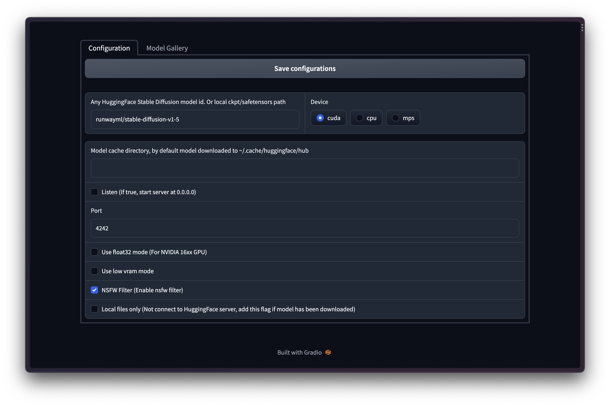
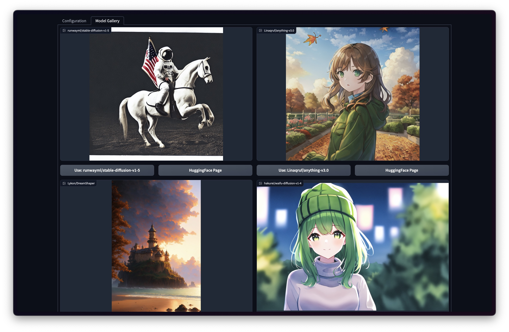

# Windows 1-click Installer

You can always install tldream for free through pip, or purchase this 1-click installer for
- Convenient environment setup.
- xformers included, vRAM efficiency and 
50% speed up
- A web interface for parameter configuration and model preview gallery
- Show your support ❤️ for this project's future development:
  - [ ] Super Resoluation
  - [ ] [GLIGEN](https://github.com/gligen/GLIGEN): Open-Set Grounded Text-to-Image Generation (CVPR 2023)

1. Get the installer from [here](https://panicbyte.lemonsqueezy.com/checkout?cart=57117696-144d-4f6d-8cee-f21130b3412a)
2. Click `win_config.bat`: This script will download all the dependencies, and start a web config page. You can config the startup parameters of the service(e.g the download path of the model.) and preview the model's effect in the Model Gallery.

   | Configuration                         | Model Gallery                          |
   | ------------------------------------- | -------------------------------------- |
   |  |  |

3. Click `win_start.bat`: The model will be automatically downloaded the first time it is used. After the service is successfully started, open a browser and visit the following address `127.0.0.1:4242`
